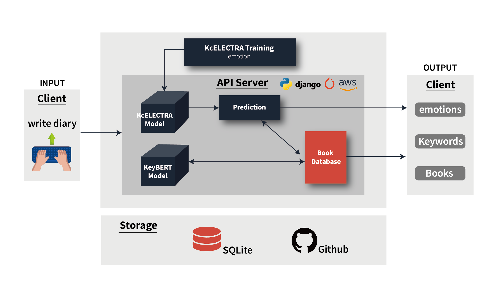
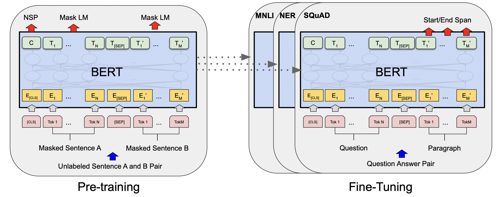
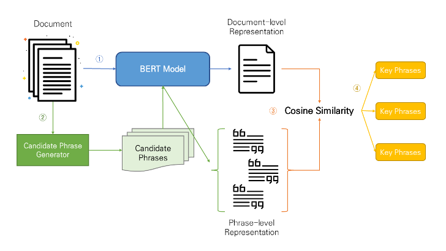
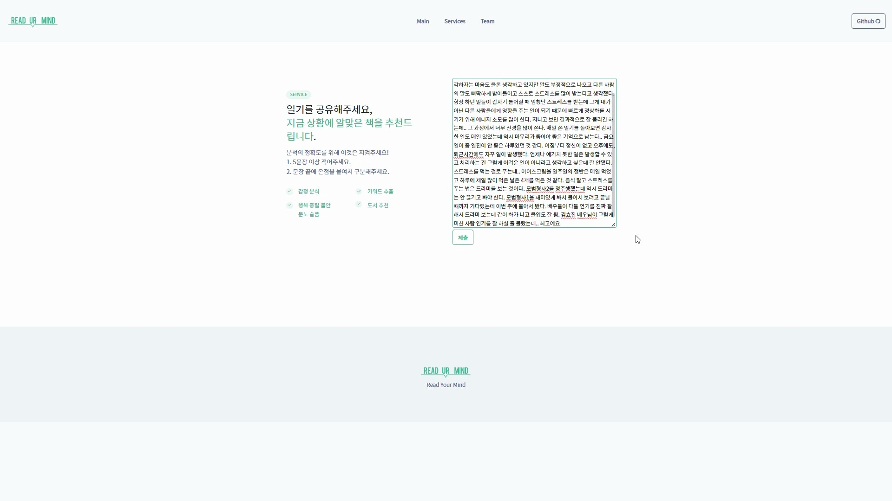
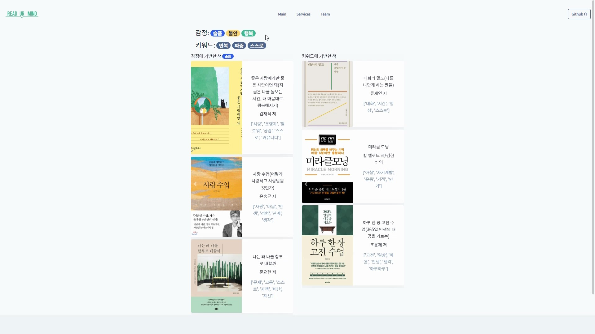
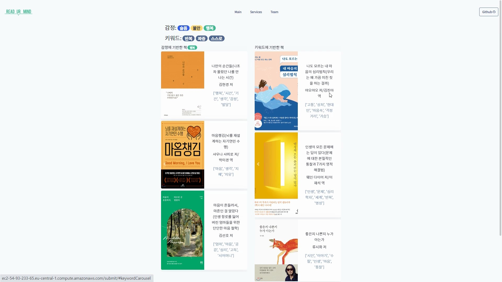

# [KDT Programmers Dev Course] Final Project

## &#128221; 프로젝트 소개

일기를 공유해주세요, 지금 상황에 알맞은 책을 추천드립니다.

[READ UR MIND (실행중단)](http://ec2-54-93-233-65.eu-central-1.compute.amazonaws.com/main/)

> "일기를 단순히 기록하는 것에서 그치는 것이 아닌, 일기에서 추출된 자신의 감정을 되돌아 보고 비슷한 감정, 키워드로 추천되는 도서를 읽으며 해소하는 것까지 서비스화 하여 현대인의 감정 해소에 도움을 주고자 한다."

## &#128101; 팀 소개
### A-4
양정우 (Leader) [@widdn955](https://github.com/wjddn955)  
김유라 [@yr2351](https://github.com/yr2351)  
심지현 [@jihhyeon](https://github.com/jihhyeon)  
여언주 [@eejj357](https://github.com/eejj357)  
이상민 [@skybluelee](https://github.com/skybluelee)

## &#128197; 프로젝트 진행 기간
**2023/01/30 - 2023/02/17**

## &#128187; 서비스 구조
### Service Architecture

1. 사용자가 일기를 입력하면 일기 데이터를 감정 분류 모델과 키워드 추출 모델에 입력으로 전달한다.
2. 감정 분류 모델에서 일기의 상위 감정 3개가 추출된다.
3. 키워드 추출 모델에서 일기의 상위 키워드 3개가 추출된다.
4. 2과 3의 결과(감정, 키워드)과 DB의 도서 데이터와 비교하여 비슷한 키워드와 감정을 가진 도서를 추출한다.
5. 추출한 감정, 키워드와 추천하는 도서를 페이지에 출력한다.

### BERT Model

- [KcELECTRA_base](https://github.com/Beomi/KcELECTRA)
- [KcBERT_base](https://github.com/Beomi/KcBERT)
- [KoBERT](https://github.com/SKTBrain/KoBERT)
- [KoELECTRA](https://github.com/monologg/KoELECTRA)
- [DistilKoBERT](https://github.com/monologg/DistilKoBERT)

위 다섯가지 BERT계열 모델들에 대해 fine-tuning과 early-stopping을 진행하여 accuracy가 가장 높게 나온 **KcELECTRA_base** 모델을 선정

### KeyBERT Model

일기와 도서에서 키워드를 추출하기 위한 키워드 추출 모델

[KeyBERT](https://github.com/MaartenGr/KeyBERT)는 BERT기반의 모델로, N-gram을 위해 단어를 임베딩 후 cosine similarity를 계산하여 어떤 N-gram 또는 단어가 문서와 가장 유사한지 찾아냄

## &#128736; Skills
- OS
    - 
- Frontend
    - 
    - 
    - 
- Backend
    - 
    - 
    - 
- Deep learning
    - 
    -  
    - 
    - 
- Groupware
    - 
    - 
    - 

## &#127910; 발표 & 시연 영상

△입력

△결과1

△결과2

## &#128269; References
- [KcElectra](https://github.com/Beomi/KcELECTRA)
- [KeyBERT](https://github.com/MaartenGr/KeyBERT)
- [AI HUB](https://aihub.or.kr/)
